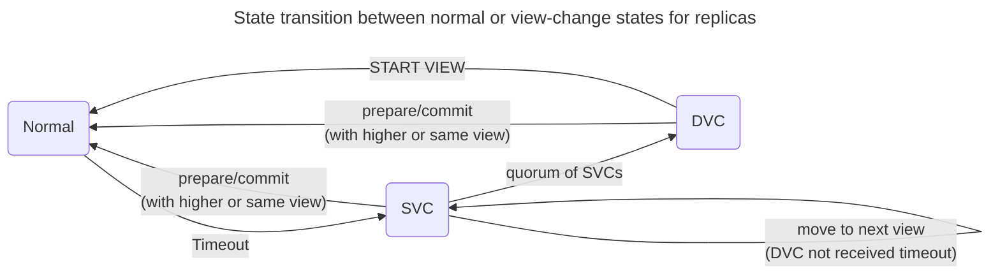

### Replicated State Machine


### Approach
Lamport has very a [short paper](https://lamport.azurewebsites.net/pubs/state-the-problem.pdf)<sup>[1]</sup> on how a problem needs to be approached. 
<br>The point it makes is <u>*first define precise correctness conditions before proposing a solution*</u>.

Defining the correctness condition independent of solution helps in formulating the solution in precise terms & subsequent verification of the solution in terms of 
the correctness conditions(*sometimes solution is defined in terms of the correctness condition itself*).

So we will discuss this paper as problem, correctness, solution & analysis in terms of correctness conditions(instead of proof).

### Problem Statement
Distributed systems consists of hosts connected through network. The algorithm needs to work considering it's environment.

* ***Concurrency:***
    * *Concurrent Requests*: The RSM can receive concurrent requests from multiple clients.  
    * *Algorithm Concurrency:* There can be concurrent operations internal to the algorithm execution itself.
* ***Failure***: 
    * The hosts can crash & restart at any time. 
    * The hosts can stall & stop processing for arbitrary lengths of time. 
    * Hosts either crash and don't participate or are totally well behaved. 
      Partial correctness(*like can send messages but are unable to receive messages*) and malicious behavior is ruled out.
* ***Network behavior***: 
    * The messages sent over the network can get arbitrarily delayed, may be lost, get duplicated or be delivered out-of-order.
    * The integrity of the messages sent over the network is ensured. 
    * If messages are sent repeatedly, then it will be delivered eventually i.e network is reliable.
* ***No Disk***: VSR doesn't require persistent storage. However failure independence of hosts is assumed. 

<todo>
Another limitation with distributed systems is that certain ***state of the system is global***(like current leader) while each of the individual hosts
have only ***local knowledge***. 

### Correctness Condition
The execution of any algorithm can be visualized as a sequence of state transitions<sup>[2]</sup>, with each state assigning some
value to the algorithm's variables. Any algorithm's correctness can be characterized using two distinct set of correctness 
conditions<sup>[3]</sup> viz. 

* ***Safety***: Every step(state transition) the algorithms takes is correct, an incorrect step can't be remedied &
* ***Liveness***: It should be always be possible for the algorithm to take another step. 

If we consider mutex as an example then no two processes should be able to enter the critical section simultaneously(***safetey***)
& it should be possible for every process to eventually enter the critical section(***liveness***).

The safety condition for the RSM is that the replicated log needs to satisfy two conditions<sup>[4]</sup>: 

* ***Agreement***: All the logs across hosts should contain the same set of commands/operations.
* ***Order***: The order of the commands present in the logs need to be same.

Liveness condition<todo>
If a set of deterministic state machines begin with the same initial state & the above two conditions are met, then 
applying the commands in the log will result in identical state machines. Ensuring these two conditions are met with the problems 
listed in the previous section is difficult.      

!!! Note 
      ***The logs may diverge under certain situations but they need to match exactly 
      w.r.t the commands that get applied to the state machine.***

### Solution 
***Primary:***
  Multiple clients can make requests to replicated state machine simultaneously. VSR chooses one replica as primary & the rest 
  act as backups. All clients send requests to the primary replica. Primary assigns a monotonically increasing number(called ***operation number***) 
  to the request received & replicates the requests to other backup replicas.    

***Primary failure:***
  If the primary fails then all the replicas together select another replica as primary & go through a reconciliation process called ***view-change***. 
  The logs across the replicas are consolidated & replicas are initialized with a new log to begin the next ***view*** ensuring the agreement & order properties 
  w.r.t committed entries. 
  
  Replicas are numbered & get chosen as primary in round robin fashion as the system goes through a sequence of view changes.
  For example in three replica system, replica 1 is primary for views {1,4,7}, replica 2 is primary for views {2,5,8} etc. 

***Backup failure:***
  If backup fails then it goes through a ***recovery*** process to restore it's state to latest system state before it can rejoin
  the rest of the replicas & participate in various operations.

***Reconfiguration:***
  The set of replicas need to be altered. Reconfiguration is required to replace a fault host or increase/decrease no. of replicas 
  in the system. Replicas store an ***epoch number*** which is incremented whenever the system goes through reconfiguration.

***Network behavior:***
  
  * *Out-of-order delivery* & *duplicates*: 
      Primary assigns monotonically increasing integer numbers to the requests received from clients.    
  * *loss*: Primary retries mitigates message loss to some extent. In practical implementations retries are limited, 
            VSR provides another mechanism(*GET-STATE* operation) to deal with message loss.  
  * *delay*: A replica can wait for a finite time(timeout) to receive a response from another replica. 
             However timeouts are only an approximate method, they are non-deterministic. We will see how this can
             cause liveness issue(*though it has limited impact*) during primary election.                 

***Algorithm concurrency:***
  For instance backup might try to recover while view-change is in progress. Replicas enter into certain state
  to deal with such concurrent operations to ensure safety. This also restricts the state space of the algorithm's
  execution which helps in simplification of the algorithm.
  <todo trade-off between availability & algorithm's simplicity> 

***Quorum:***
  
  *Quorum intersection property*: 
  If we consider a set of `2F + 1` elements, then at least one element is common between any two subsets consisting of `F + 1` elements(***majority***/***quorum***).
  VSR uses this property to achieve ***reliability***:. 

  * Primary replicates a request to at least a quorum of replicas before it commits the request to state machine,
    ***commit number*** is incremented after a request is applied to state machine. 
  * When a primary fails & new primary is elected, logs are gathered from a quorum of replicas for reconciliation of the
    system state before next ***view*** is started. 
  * Similarly, when a backup fails it gathers state from a quorum of replicas to reinitialize it's state.   

  The above three conditions ensure that there is continuity w.r.t the system state i.e any committed entry is known
  to at least one replica in the quorum. Since only a quorum of replicas are necessary for correct functioning 
  of the system, up to `F` failures can be sustained. 
  Thus the system achieves both ***reliability*** & ***fault tolerance***.  

  <todo normal, view-change, recovery terminology>

??? "Summary: Problem-Solution"
    | **Problem**| **Solution**|
    |------------|-------------|
    | *Concurrent client requests*| *A single primary handles all client requests*.|
    | *Algorithm Concurrency (e.g: recovery during reconfiguration)* | *Algorithm states restrict certain concurrent operations which simplifies design & helps in ensuring safety*.|
    | *Primary Failure*| *New primary election leveraging quorum replication, system goes through reconciliation process*.|
    | *Backup Failure*| *Recovery mechanism leveraging quorum replication,  failure independence assumed*.|
    | *Message loss, out-of-delivery, duplication, delay*| *Algorithm needs additional mechanism to deal with these issues*. In particular, delay needs timeout.|

### Abstract Representation

An abstract representation of a host in VSR system is as shown below: 
```title="Replica"     
  - epoch-no:  epoch number abstracts system configuration, if replicas present in system change 
               then system goes through a epoch change.    
  - view-no:   view number abstracts failure(primary replica changes), if a primary fails then 
               the system goes through a view change. 
  - op-no:     it's an index for a slot in the log, each slot contains one request or command. 
  - commit-no: identifies the op-no up to which the state machine has consumed the input requests 
               or commands.                 

  Replicated log: 
  |<=======================================time=====================================>|    
  |<~~~~~~~~~~~~~e1~~~~~~~~~~~>|<~~~~~~~~~~~~~~~~~~~~~~~e2~~~~~~~~~~~~~~~~~~~~~~~~~~>|
  |<----v1---->|<------v2----->|<---v3-->|<----v4---->|<-------------v5------------->|
  |<a><b><c><d>|<e><f><g><h><i>|<j><k><l>|<m><n><o><p>|<q><r><s><t><u><v><w><x><y><z>|
  
  en: epoch-no <todo subscript>
  vn: view-no
  <.>: operations or command

  - replica-no:     each replica is numbered, view number is mapped to replica-no & thus primary is determined. 
  - configuration:  the set of replicas in the system.
  - status:         each replica maintains a status which corresponds to the sub-protocol that it is executing.

  Note: Epoch & view numbers can be discontinuous but operation number is continuous, always.
```

Messages exchanged among replicas are represented as `<MESSAGE-NAME comma separated parameters>` e.g `<PREPARE v,m,n,k>`.
The attributes carried in various messages are shown below, view & epoch parameter reflect the system state. 
  
```title="Message Attributes"
  v: view-number  k: commit-number      v: last normal view   i,j: replica number   e: epoch-number
  l: log          n: operation-number   m: operation          x: context dependent
                  (log index)           (client message)
```

### Analysis 

#### Normal 

!!! note annotate "Correctness Condition, Normal Sub-Protocol (1)"
    ```
      Safety:    
        * Primary should ensure the agreement & order condition i.e client requests 
          should be replicated consistently(no divergence) across all the replicas.       
      Liveness:            
        * Eventually the client requests should be replicated across all the replicas.
        * Eventually all the requests should be applied to the state machines on both primary & backup replicas.
    ```
1. !!! Note "*Normal Sub-Protocol*"
       1. Backups process request if their status is `normal` & view matches with that in the request message. 
           - If view-no is lesser then message is ignored 
           - if view-no is greater then replica moves to that view by doing a `<GET-STATE>` operation(discussed later).
       * Primary receives request from client & adds it to it's log by incrementing 
         it's ***operation number***.  
       * Primary sends `<PREPARE v,m,n,k>` message to add an entry to the backup replica. 
       * Backup accepts `PREPARE` request only if ***operation number*** in the request is one more 
         compared to the top most entry's index in it's log.
           - Backup sends `<PREPAREOK v,n,i>` if it accepts the request from primary.
           - If backup sees it is missing entries then it sends `<GET-STATE v,n,i>`. 
             to one of the replicas to get missing entries & then sends `<PREPAREOK>` reply.
       * Primary commits requests if it receives a quorum of `<PREPAREOK>` replies, 
         primary communicates the commit index either through next `<PREPARE>` message or by 
         sending `<COMMIT>` messages, periodically. `<COMMIT>` also acts a heart beat mechanism.
         - If backup identifies missing entries when it receives `<COMMIT>` message, 
           backup will do a `<GETSTATE>` operation to fetch the missing entries.
  
#### View Change

!!! note annotate "Correctness Condition, View-Change Sub-Protocol (1)"
    ```
      Safety:    
        * During view-change all the committed entries need to be preserved maintaining agreement & order condition.       
      Liveness:            
        * View-change should complete & normal processing should resume, should not be stuck in SVC/DVC messaging.
    ```
1. !!! Note "*View-Change Sub-Protocol*"  
        1. If a backup doesn't receive timely PREPARE/COMMIT messages then it increments it's
           view-number, changes it's state to `view-change` & triggers view-change 
           by broadcasting `<START-VIEW-CHANGE v,i>` message.
        *  When a quorum(including self) of SVC messages are received by a backup, it sends 
           `<DO-VIEW-CHANGE v,l,v',n,k,i>` message to the new primary(determined by 
           the incremented view-number), l corresponds to it's log in it's last normal view v'.  
        *  When the new primary receives are quorum(including self) of DVC messages it reconciles 
           the logs received in DVC messages. A new log is chosen based on: 
            * largest v', if multiple logs have same v' then one with largest n is chosen.
            * k is chosen to be largest of such values received in the DVC messages.        
        * New primary sends `<START-VIEW v,l,n,k>` message to all replicas with log chosen in 
          the previous step and starts normal operation.
        * If replicas don't receive `<START-VIEW>` messages then backups trigger another round
          of SVC/DVC messaging by advancing to the next view.  
        
        Note: 
        
        1. The new primary might or might not be part of SVC messaging.
        2. Quorum reply for `<START-VIEW>` request is not necessary for new primary to begin normal processing as safety is
           preserved by replication to quorum before commit can happen.

!!! Warning "SVC Messaging" 
    ***SVC messaging is crucial for view-change as it ensures log stability before entering the DVC phase which reconciles the logs.*** 
    ***<br>A primary might have slowed down(not crashed) & timeout occurred.***
    ***<br>SVC phase ensures that quorum of replicas agree to stop processing the requests from the primary before entering into DVC phase.***

##### **Network Partitions** 
When a network partition occurs `PREPARE`/`COMMIT` messages will be lost which can trigger view changes. 
There are two cases depending on which side of partition the primary is present. These scenarios need to be 
analyzed as the paper discusses about primary failure only. 

??? Note "Network split with majority containing the primary" 
    === "View<sub>majority</sub> < View<sub>minority</sub>"
        <table>
        <thead>
          <tr>
            <th>time</th>
            <th>majority</th>
            <th>minority</th>
            <th>context</th>
          </tr>
        </thead>
        <tbody>
          <tr>
            <td>t1</td>
            <td>V<sub>majority</sub> = V</td>
            <td>V<sub>minority</sub> = V</td>
            <td>Network partition occurs</td>
          </tr>
          <tr>
            <td>t2</td>
            <td>V<sub>majority</sub> = V<br>Status = normal</td>
            <td>V<sub>minority</sub> = V + 1<br>Status = view-change<br>Phase = SVC</td>
            <td>* Minority doesn't receive heart   beat messages &amp; moves to view-change. <br>* It's stuck in SVC as there is no majority</td>
          </tr>
          <tr>
            <td>t3</td>
            <td colspan="2">* Both groups join &amp; view-change continues. <br>* The group as whole moves to view v+1. <br>* However this view-change is **unnecessary** as  majority was functioning normally.</td>
            <td>Network partition heals</td>
          </tr>
        </tbody>
        </table>
    === "View<sub>majority</sub> = View<sub>minority</sub>"
        <table style="undefined;table-layout: fixed; width: 935px">
        <colgroup>
        <col style="width: 40.2px">
        <col style="width: 193.2px">
        <col style="width: 343.2px">
        <col style="width: 358.2px">
        </colgroup>
        <thead>
          <tr>
            <th>time</th>
            <th>majority</th>
            <th>minority</th>
            <th>context</th>
          </tr>
        </thead>
        <tbody>
          <tr>
            <td>t1</td>
            <td>V<sub>majority</sub> = V</td>
            <td>V<sub>minority</sub> = V<br></td>
            <td>Network partition occurs</td>
          </tr>
          <tr>
            <td>t2</td>
            <td>V<sub>majority</sub> = V<br><br>Status = normal</td>
            <td>V<sub>minority</sub> = V + 1<br>Status = view-change<br>Phase = SVC</td>
            <td>* Minority doesn't receive heart   beat messages &amp; moves to view-change. <br>* It's stuck in SVC as there is no majority</td>
          </tr>
          <tr>
            <td>t3</td>
            <td>V<sub>majority</sub> = V + 1<br>Status = normal</td>
            <td>V<sub>minority</sub> = V + 1<br>Status = view-change<br>Phase = SVC</td>
            <td>Primary crashes &amp; majority   advances to it's view.</td>
          </tr>
          <tr>
            <td>t4</td>
            <td colspan="2">* Majority receives SVC messages which it needs to ignore since it is already in <br>same view with status as normal which can be considered to be further ahead on the timeline.   <br>* Minority will receive PREPARE/COMMIT messages from primary. <br>Minority can move to normal state by transferring state through <br>GET-STATE operation. <br>***Note that primary could have added some entries in view V before proceeding to view V+1.***</td>
            <td>Network partition heals.</td>
          </tr>
        </tbody>
        </table>
    === "View<sub>majority</sub> > View<sub>minority</sub>"
          <table style="undefined;table-layout: fixed; width: 906px">
          <colgroup>
          <col style="width: 40.2px">
          <col style="width: 159.2px">
          <col style="width: 342.2px">
          <col style="width: 364.2px">
          </colgroup>
          <thead>
            <tr>
              <th>time</th>
              <th>majority</th>
              <th>minority</th>
              <th>context</th>
            </tr>
          </thead>
          <tbody>
            <tr>
              <td>t1</td>
              <td>V<sub>majority</sub> = V</td>
              <td>V<sub>minority</sub> = V</td>
              <td>Network partition occurs</td>
            </tr>
            <tr>
              <td>t2</td>
              <td>V<sub>majority</sub> = V<br>Status = normal</td>
              <td>V<sub>minority</sub> = V + 1<br>Status = view-change<br>Phase = SVC</td>
              <td>* Minority doesn't receive heart   beat messages &amp; moves to view-change. <br>* It's stuck in SVC as there is no majority</td>
            </tr>
            <tr>
              <td>t3</td>
              <td>V<sub>majority</sub> = V + 2</td>
              <td>V<sub>minority</sub> = V + 1</td>
              <td>Majority goes through multiple view changes</td>
            </tr>
            <tr>
              <td>t4</td>
              <td colspan="2">* SVC messages from minority group will be ignored since majority has higher  view-no.<br>* Minority receives PREPARE/COMMIT from the primary. 
              <br>***Minority can move to normal state by transferring state through GET-STATE operation***.     </td>
              <td>Network Partition heals.</td>
            </tr>
          </tbody>
          </table>

??? Note "Network split with minority containing the primary" 
    **Note:** *View<sub>majority</sub> < View<sub>minority</sub>* doesn't seem to be possible  
    === "View<sub>majority</sub> > View<sub>minority</sub>"
        <table>
        <thead>
          <tr>
            <th>time</th>
            <th>majority</th>
            <th>minority</th>
            <th>context</th>
          </tr>
        </thead>
        <tbody>
          <tr>
            <td>t1</td>
            <td>V<sub>majority</sub> = V</td>
            <td>V<sub>minority</sub> = V</td>
            <td>Network partition occurs</td>
          </tr>
          <tr>
            <td>t2</td>
            <td>V<sub>majority</sub> = V + 1<br>Status = normal</td>
            <td>V<sub>minority</sub> = V<br>Status = normal<br>     </td>
            <td>Minority continues receiving heart beat messages, <br>hence view number doesn't advance</td>
          </tr>
          <tr>
            <td>t3</td>
            <td colspan="2">* Minority group receives PREPARE/COMMIT messages<br>* As minority notices higher view number it does GET-STATE operation and thus advances it's view.</td>
            <td>Network partition heals</td>
          </tr>
        </tbody>
        </table>
    === "View<sub>majority</sub> = View<sub>minority</sub>"
        <table>
        <thead>
          <tr>
            <th>time</th>
            <th>majority<br>&nbsp;&nbsp;&nbsp;&nbsp;&nbsp;</th>
            <th>minority</th>
            <th>context</th>
          </tr>
        </thead>
        <tbody>
          <tr>
            <td>t1</td>
            <td>V<sub>majority</sub> = V</td>
            <td>V<sub>minority</sub> = V</td>
            <td>Network partition occurs</td>
          </tr>
          <tr>
            <td>t2</td>
            <td>V<sub>majority</sub> = V + 1<br>Status = normal</td>
            <td>V<sub>minority</sub> = V<br>Status = normal<br>     </td>
            <td>Minority continues receiving heart beat <br>messages, hence view number doesn't advance</td>
          </tr>
          <tr>
            <td>t3</td>
            <td>V<sub>majority</sub> = V + 1<br>Status = normal</td>
            <td>V<sub>minority</sub> = V + 1<br>Status = view-change<br>Phase = SVC</td>
            <td>Primary crashes</td>
          </tr>
          <tr>
            <td>t4</td>
            <td colspan="2">* Majority receives SVC messages which it needs to ignore since it is already in same view with status as normal which can be considered to be further ahead on the timeline.   <br>* Minority will receive PREPARE/COMMIT messages from primary. <br>  Minority can ***move to normal*** state by transferring state through GET-STATE operation. <br><br>***Even though view is same state transfer should be done from last commit index since minority*** <br>***has gone through view-change &*** 
             ***in the process one or more operation numbers could have been reassigned to different client requests.***</td>
            <td>Network partition heals</td>
          </tr>
        </tbody>
        </table>

??? success "Results"
    GET-STATE is discussed only in the context when the replicas are in normal state.
    
    * During network partition replicas can be in view-change state and receive PREPARE/COMMIT
    messages. Replicas need to move to normal state through `GET-STATE` operation.
    * Even if view matches when backup receives PREPARE/COMMIT while it's in view-change, 
      it needs to transfer entries from it's last commit point(unlike as done during normal operation).  
    * Sometimes unnecessary view-change is triggered.

    Note that SVC messaging should continue ***indefinitely***(till network partition heals) for 
    the replicas in the backup to rejoin.

##### Data Loss with GET-STATE
Note that for `GET-STATE` in view-change scenario, the paper says backup replica clears up entries beyond it's commit index
before sending a `<GET-STATE>` request. This should ring an alarm as an entry which is already committed might now be
present on less than a quorum of replicas, violating the safety property.

Imagine the following scenario:
```
A system consisting of three replicas viz. r1, r2, r3.
* r1 is the primary & view is 1, r1 & r2 participated in normal operation with
  some entries getting committed by r1. 
* r1 goes offline(doesn't crash), view change for views 2 & 3 are unsuccessful 
  with r2 & r3 being participants.
* r1 comes back & becomes primary for view 4 with r1 & r3 being participants,
  however r3 din't receive start-view message, so it's log is same as it was in view 1.
* r1 sends prepare message to r2 with view as 4 & crashes, r2 truncates it's log before 
  sending <get-state> request.     

Even though two replicas are available r2 & r3, committed entry is lost.
```

##### Decreasing Commit Index  
It is possible that primary has committed certain entries but the same has not been conveyed to the backup replicas through 
PREPARE/COMMIT messaging i.e primary's commit-index is ahead of backups. 
If a view-change occurs at this stage & ships the log to previous primary(din't crash but slowed down) then it's commit-index can decrease. 
The scenario is illustrated below. If primary crashes & recovers then same behavior is observed. 

??? Note "Commit index decreases"
    ```  
                              <n=1,k=0>           <n=1,k=0>
    1--<a>--(a)---<a>--------(a)--#--!!!!!!!!!!--sv----             <a>: request
        \   /      \         /    <n=1,k=1>      /                  (a): response
        \ /        \       /                   /                   x: entry added
    2-----x----------\-----/-------------------sv------             #: commit
          a           \   /                     \                   !!!: primary pauses, view-change  
                      \ /                       \                  sv: start-view message  
    3-------------------x------------------------sv----
                        a                        <n=1,k=0>
    ```

As a solution the state machine needs to dedupe based on the operation number(which needs to be persisted
as entries get applied to state machine since VSR doesn't use disk for any of it's operation).


##### FLP & VSR
FLP states that consensus is not possible in an async system even with a single faulty process under certain circumstances i.e consensus is 
not possible sometimes. If a primary chosen through SVC-DVC messaging becomes faulty(crash or slows down) then the remaining replicas
are in dilemma:

  * is new primary slow, should they wait longer ?
  * has the chosen primary crashed & should they start another round of SVC-DVC messaging incrementing the view number ?   
  
In my understanding, this is the manifestation of FLP in the VSR algorithm. 
It seems like FLP has much lesser impact compared to RAFT or Paxos as replicas don't compete(to be next primary) 
rather co-ordinate in selecting the next primary. The impact is minimal as the chosen primary has to be down.

#### Recovery

!!! note annotate "Correctness Condition, Recovery Sub-Protocol (1)"
    ```
      Safety:    
        * Backup should recover into the latest view of the system.       
      Liveness:            
        * Recovery should complete in timely manner without getting stuck.
    ```

1. !!! Note "*Recovery Sub-Protocol*"
        1. VSR doesn't use disk, failure independence is assumed. 
        * Gather state from a quorum of replicas including primary
          of the view to which the backup is recovering.
        * 

##### **Primary Failure**: 
If a primary fails then it recovers into the next view after a new primary is elected. 
Since recovery process requires primary among the quorum of replicas using which recovery is executed.

##### **Recovery during view-change**:
If a backup attempts recovery during an ongoing view-change then there are two possibilities:

* Recover into view, V, prior to view-change:
    If backup is able to contact 
* Recovers into view, V+1, after view-change:
    * 
  In such cases the backup has to restart recovery process.

### Practical Implementation
* `System state = App State + Log State`
* `App state = Checkpoints, Snapshot, Merkle Tree`
One may check [Paxos Made Live]() for challenges encountered with real world implementation of RSM.

### Conclusion

!!! Note "Inference"
    * On paper analysis of the algorithm is ***extremely difficult*** due to <u>***concurrency, out-of-order message delivery*** 
      ***& failure***</u> occurring at any moment. 
      Formal verification(like TLA+ which explores the algorithm's state space) becomes imperative.  
    * Following cases w.r.t view-change operation were discovered:
        * `View-Change` to `Normal` state transition with replicas in `view-change` state having same or lesser view.
          <br>Even in the case of same view, state transfer needs to be done from last commit-index.
        * Data loss w.r.t `GET-STATE` operation.
        * Commit index going backwards. 
    * Following cases w.r.t recovery operation were discovered:
        * VSR makes broad sketches w.r.t recovery operation, modeling can be helpful here while filling the gaps w.r.t details.
        * The recovery operation might have to be restarted if it gets triggered during an ongoing view-change operation.        
    * Practical implementation need to consider application state transfer along with log entries transfer for 
      view-change & recovery operations.  
    * VSR pushes all disk operation to the background in order to achieve performance. This can be limited
      to data replication alone & explore storing certain other information on disk if it helps in achieving
      algorithm simplicity.
    * VSR uses algorithm states so as to disable certain operations while others are in progress. In certain cases
      this a trade-off between availability & simplicity of the algorithm(vertical Paxos abstract reads as 
      "reconfiguration in the middle of consensus").

### References
<todo add-references>
1. [State the Problem Before Describing the Solution](https://lamport.azurewebsites.net/pubs/state-the-problem.pdf)
2. [Safety, Liveness, and Fairness](https://lamport.azurewebsites.net/tla/safety-liveness.pdf)
3. [Defining Liveness](https://www.cs.cornell.edu/fbs/publications/DefLiveness.pdf)



==============================================================================================
```
Replicated State Machine -> Replicated log -> Basis for building fault tolerant System 

The operations present in replicated log when applied to state machines across replicas result in identical machines, hence it is basic primitive for realizing various fault tolerant 
distributed systems like database, storage etc.

VSR is replication algorithm which can be used to realize a replicated state machine(RSM) which consists of a distributed/replicated log consisting of same set of operations(agreement) & in the same sequence(order)
<todo add-reference>. 

Unlike Paxos VSR is structured as replication algorithm & thus more aligned towards realizing a RSM. 
However, VSR uses a Paxos like consensus algorithm for part of it's operation(primary election) - atomic broadcast(reliable replication) & consensus are equivalent problems<todo add-reference>.

Replication should satisfy two conditions<todo add-reference>:
  * Agreement: All logs should contain same entries.
  * Order: The entries across different logs should follow same order.  
  
  These fairly simple conditions are difficult to maintain in distributed system.

  VSR is replication algorithm which uses Paxos like consensus algorithm for part of it's operation - reliable broadcast & consensus are equivalent problems<add-ref> 

  No Disk - either for consensus or for storing replicated data, assuming independent failure.  
  Byzantine ??
  
  Client <-> VSR <-> SM
````
==============================================================================================